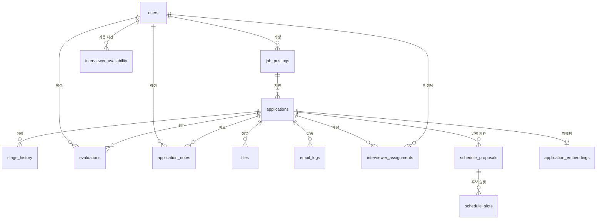

# 01. 테이블 정의서 (ERD)

> **상태: 확정 v1.4 · 2026-08-31** — v1.4: 시맨틱 검색용 `application_embeddings` 를 문서에 반영 ([ADR-0021](../03_decision/0021-RAG-시맨틱-검색.md)). 테이블은 코드에 먼저 들어가 있었고 이 문서가 비어 있었다 — 문서를 코드에 맞췄다.
> v1.3 (2026-08-31): `users.role` 을 `admin`/`member` 2종으로 축소, A3(면접관 조회 제한) 폐지 ([ADR-0017](../03_decision/0017-등급-이분화.md)). 테이블·컬럼 구조는 그대로다 — 바뀐 것은 `role` 의 허용값과 접근 규칙뿐.
> v1.2 (2026-08-31): 면접 일정 자동화 3테이블 `interviewer_availability`·`schedule_proposals`·`schedule_slots` 추가 ([ADR-0016](../03_decision/0016-면접-일정-자동화.md))
> v1.1 (2026-08-25): `job_postings.deadline`·`public_token`(B4·B6), `stage_history.reason`(D8) 추가 (팀장 승인)
>
> **규칙: 확정 이후의 모든 변경은 전원 합의로만 한다.**
> 임의로 테이블·컬럼을 추가/변경하지 않는다. 필요하면 팀 채널에 제안 → 합의 → 이 문서 갱신 → 마이그레이션 순서.

필수 27기능 기준. ○ 권장 기능의 확장 포인트는 각 표의 비고에 적어둔다.

실제 테이블은 [backend/app/models.py](../../backend/app/models.py)에 이 문서의 표 순서 그대로 옮겨져 있다. **어긋나면 이 문서가 기준이다** — 문서를 먼저 고치고 모델을 맞춘다.

## 관계 요약

## 단계(stage) — 고정 enum

`applied`(지원 접수) → `screening`(서류 검토) → `interview`(면접) → `accepted`(최종 합격) / `rejected`(불합격)

- 단계 커스터마이징(B8)은 범위 밖. DB enum이 아닌 **체크 제약 + 코드 상수**로 관리해 마이그레이션 부담을 줄인다.
- 비고: 에이전트 정리→담당자 검수 플로우(여유 기능) 도입 시 `applied` 앞에 `pending_review`(검수 대기) 상태 추가 여지 — 검수 승인 시점에 공식 지원 접수로 진입.
- `rejected`는 어느 단계에서든 진입 가능. 그 외 전진은 순서대로만(뒤로 이동은 담당자 권한). 전환 규칙은 백엔드 서비스 레이어에서 강제한다.

## users — 내부 사용자 (A1·A2)

| 컬럼 | 타입 | 제약 | 설명 |
|---|---|---|---|
| id | bigint | PK | |
| email | varchar(255) | UNIQUE, NOT NULL | 로그인 ID |
| password_hash | varchar(255) | NOT NULL | bcrypt |
| name | varchar(50) | NOT NULL | |
| role | varchar(20) | NOT NULL | `admin` / `member` 2종 ([ADR-0017](../03_decision/0017-등급-이분화.md)). 위계가 아니라 조작 권한의 유무다 — 조회는 로그인한 사람 전체에게 열려 있고, `admin` 에게만 남은 것은 면접관 배정/해제·계정 생성·메일 템플릿·**남의** 가용 시간이다. `member` 의 유일한 제한은 평가 작성(배정된 건만) |
| created_at | timestamptz | NOT NULL, default now() | |

비고: A5 로그인 이력(권장)은 `login_logs` 별도 테이블로 추가 가능 — 본 스키마 변경 없음.

기존 DB 의 `recruiter`·`interviewer` 행 이행은 `backend/scripts/migrate_roles_to_member.sql` 로 한다 (체크 제약 교체 포함, 1회성). 실행법은 [07-deploy.md](07-deploy.md).

## job_postings — 채용 공고 (B1·B2)

| 컬럼 | 타입 | 제약 | 설명 |
|---|---|---|---|
| id | bigint | PK | |
| title | varchar(200) | NOT NULL | |
| description | text | | 공고 본문 |
| status | varchar(20) | NOT NULL | `draft` / `open` / `closed` |
| deadline | date | NULL 허용 | 마감일 (B4). NULL = 상시 접수 |
| public_token | varchar(64) | UNIQUE, NULL 허용 | 공개 지원 링크 토큰 (B6). NULL = 미발급 |
| created_by | bigint | FK → users.id | |
| created_at / updated_at | timestamptz | NOT NULL | |

비고: B3 지원자 수는 집계 쿼리로(컬럼 안 둠).

## applications — 지원서 (C1·D1·D6) ★핵심 테이블

지원자는 로그인 없이 지원하므로(C1) 지원자 정보를 별도 인물 테이블로 나누지 않고 지원서에 포함한다. (D11 인재풀을 하게 되면 그때 `applicants` 분리 — 전원 합의 필요)

| 컬럼 | 타입 | 제약 | 설명 |
|---|---|---|---|
| id | bigint | PK | |
| job_posting_id | bigint | FK → job_postings.id, NOT NULL | |
| name | varchar(50) | NOT NULL | |
| email | varchar(255) | NOT NULL | |
| phone | varchar(20) | NOT NULL | |
| education | varchar(100) | | 최종 학력 |
| career_years | smallint | | 경력 연차 (신입=0) |
| skills | text[] | | 기술 태그. 예: `{Python,FastAPI}` |
| self_intro | text | | 자기소개서 |
| ai_summary | text | | 담당자용 AI 요약 — 자소서 요지 + 공고 요건 대비 적합/우려. NULL = 미생성 |
| ai_summary_at | timestamptz | | 생성 시각. 공고 요건 변경 시 재생성 판단 기준 |
| ai_summary_model | varchar(50) | | 생성 모델명 — 발표 때 근거 제시용 |
| current_stage | varchar(20) | NOT NULL, default `applied` | 위 stage enum |
| privacy_agreed_at | timestamptz | NOT NULL | 개인정보 동의 시각 (C3) |
| source | varchar(20) | NOT NULL, default `form` | `form`(외부 지원) / `manual`(담당자 등록, D6) |
| created_at / updated_at | timestamptz | NOT NULL | |

- UNIQUE `(job_posting_id, email)` — 중복 지원 방지(C6, 권장이지만 제약 하나로 끝나므로 처음부터 포함)
- 인덱스: `(job_posting_id, current_stage)` — 칸반·단계 필터(H2)
- 인덱스: `(created_at DESC, id DESC)` — 최신순 목록·커서 페이지네이션(H4·H5). B 담당 측정([perf-search.md](../perf-search.md), #68) 기반으로 팀장 승인 (2026-08-25). 비용: 3.2MB · 쓰기 +19%
- AI 요약은 접수 시 1회 생성해 저장하고, 상세 패널은 저장값을 즉시 표시한다. 패널 열 때마다 생성하지 않는다(연속 심사 지연·호출 비용·재현성). 재생성은 명시적 버튼으로만. 요약이 공고 요건에 종속되지만 지원서 1건은 공고 1건에 묶이므로 별도 테이블 없이 applications에 직접 둔다.

## stage_history — 단계 변경 이력 (D5)

| 컬럼 | 타입 | 제약 | 설명 |
|---|---|---|---|
| id | bigint | PK | |
| application_id | bigint | FK → applications.id, NOT NULL | |
| from_stage | varchar(20) | | 최초 접수 시 NULL |
| to_stage | varchar(20) | NOT NULL | |
| changed_by | bigint | FK → users.id, NULL 허용 | NULL = 시스템(외부 지원 접수) |
| reason | text | NULL 허용 | 불합격 사유 (D8). `rejected` 진입 시 기록 |
| created_at | timestamptz | NOT NULL | |

## evaluations — 평가 (E1·E2)

| 컬럼 | 타입 | 제약 | 설명 |
|---|---|---|---|
| id | bigint | PK | |
| application_id | bigint | FK → applications.id, NOT NULL | |
| evaluator_id | bigint | FK → users.id, NOT NULL | |
| score | smallint | NOT NULL, 1~5 체크 | |
| comment | text | | |
| created_at / updated_at | timestamptz | NOT NULL | |

비고: E4 항목 분리(권장) → `category` 컬럼 추가 여지. E5 본인만 수정은 코드에서 `evaluator_id` 검사.

## application_notes — 담당자 메모 (기능 번호 미지정)

평가(`evaluations`)와 분리한다. 저쪽은 점수 1~5가 필수인 평가 행이라, 점수 없는 서술형 기록이 섞이면 평가 목록·평균이 오염된다.

| 컬럼 | 타입 | 제약 | 설명 |
|---|---|---|---|
| id | bigint | PK | |
| application_id | bigint | FK → applications.id, NOT NULL | |
| author_id | bigint | FK → users.id, NOT NULL | 작성자 |
| body | text | NOT NULL | 서술형 메모 |
| created_at / updated_at | timestamptz | NOT NULL | |

- 인덱스 `(application_id, created_at DESC)` — 상세 패널 최신순 표시
- 수정·삭제는 작성자 본인만(코드에서 `author_id` 검사)
- **한 문서를 공동 편집하지 않고 각자 행을 추가하는 구조** — 동시 편집 충돌 처리가 필요 없다([ADR-0005](../03_decision/0005-실시간-공동편집-제외.md))

## files — 이력서 파일 (F1·F2)

| 컬럼 | 타입 | 제약 | 설명 |
|---|---|---|---|
| id | bigint | PK | |
| application_id | bigint | FK → applications.id, NOT NULL | |
| s3_key | varchar(500) | NOT NULL | 버킷 내 경로 |
| filename | varchar(255) | NOT NULL | 원본 파일명 |
| size_bytes | bigint | NOT NULL | |
| content_type | varchar(100) | NOT NULL | |
| kind | varchar(20) | NOT NULL | `resume`(이력서) / `cover_letter`(자기소개서) — 지원자는 이 2종을 제출 |
| created_at | timestamptz | NOT NULL | |

업로드는 presigned URL로 브라우저 → S3 직행. 서버는 키 발급과 이 레코드만 만든다.

**미결**: S3를 쓰지 않고 로컬 디스크 저장으로 가면 `s3_key` → `storage_path`로 이름이 바뀐다. 지금 바꾸면 한 줄이고, API·화면이 올라간 뒤면 그것들까지 따라간다.

비고: 화면 표시는 규격 파일명(`{지원자명}_{유형}.{확장자}`)을 코드에서 생성해 쓰고, `filename`(원본)은 보존해 보조 표기한다. 허용 형식 pdf·docx·hwp(hwpx). 자소서가 이력서에 포함된 경우 `resume` 1건만 존재할 수 있다.

## email_logs — 메일 발송 (G1~G3)

| 컬럼 | 타입 | 제약 | 설명 |
|---|---|---|---|
| id | bigint | PK | |
| application_id | bigint | FK → applications.id, NOT NULL | |
| to_email | varchar(255) | NOT NULL | |
| stage | varchar(20) | NOT NULL | 어떤 단계 변경 건인지 |
| status | varchar(20) | NOT NULL, default `queued` | `queued` / `sent` / `failed` |
| retry_count | smallint | NOT NULL, default 0 | |
| sent_at | timestamptz | | |
| created_at | timestamptz | NOT NULL | |

흐름: 단계 변경 → 이 레코드 생성 + SQS 발행 → 워커가 SES 발송 → status 갱신. 실패 시 재시도(G3), 상한 초과 시 `failed`.

## interviewer_assignments — 면접관 배정 (E3)

"이 지원자의 면접관은 누구인가"를 담는 관계 테이블. 배정·해제는 **admin 전용**이다 ([ADR-0013](../03_decision/0013-면접관-배정-정책.md)).

옛 A3(면접관은 배정된 지원자만 조회)는 폐지됐다 — 조회는 로그인한 사람 전체에게 열려 있다 ([ADR-0017](../03_decision/0017-등급-이분화.md)). 이 관계가 남기는 제한은 하나뿐: **`member` 는 배정된 건만 평가를 쓸 수 있다.**

`interviewer_id` 는 역할이 아니라 "그 건의 면접관"이라는 관계다. 역할이 2종으로 줄어든 뒤에도 컬럼명은 그대로 두며, 배정 대상의 role 은 검사하지 않는다 — 누구나 면접관으로 배정될 수 있다.

| 컬럼 | 타입 | 제약 | 설명 |
|---|---|---|---|
| id | bigint | PK | |
| application_id | bigint | FK → applications.id, NOT NULL | |
| interviewer_id | bigint | FK → users.id, NOT NULL | |
| assigned_by | bigint | FK → users.id, NOT NULL | |
| created_at | timestamptz | NOT NULL | |

- UNIQUE `(application_id, interviewer_id)`

## interviewer_availability — 면접관 가용 시간 (일정 자동화 · v1.2)

면접관이 "면접 가능한 시간대"를 등록한다. 후보 슬롯 생성의 입력이다. ([ADR-0016](../03_decision/0016-면접-일정-자동화.md))

| 컬럼 | 타입 | 제약 | 설명 |
|---|---|---|---|
| id | bigint | PK | |
| interviewer_id | bigint | FK → users.id, NOT NULL | 대상 role 검사 없음 — 누구나 면접관이 될 수 있다 ([ADR-0017](../03_decision/0017-등급-이분화.md)) |
| start_at | timestamptz | NOT NULL | |
| end_at | timestamptz | NOT NULL, CHECK(start_at < end_at) | |
| created_at | timestamptz | NOT NULL | |

- 인덱스 `(interviewer_id, start_at)` — 면접관별 기간 조회
- 반복 규칙(매주 화 14~18시 등)은 두지 않는다 — 구간 행을 여러 개 넣는 것으로 갈음(범위 절제). 필요해지면 그때 논의.

## schedule_proposals — 면접 일정 제안 (일정 자동화 · v1.2)

지원자 1명에게 보내는 "이 중에서 고르세요" 제안 한 건. 지원자는 로그인이 없으므로 `public_token`(B6)과 같은 **토큰 공개 접근** 패턴을 쓴다.

| 컬럼 | 타입 | 제약 | 설명 |
|---|---|---|---|
| id | bigint | PK | |
| application_id | bigint | FK → applications.id, NOT NULL | |
| token | varchar(64) | UNIQUE, NOT NULL | 지원자 공개 접근 토큰. 메일 링크에 실린다 |
| status | varchar(20) | NOT NULL, default `proposed` | `proposed` / `confirmed` / `expired` / `canceled` |
| confirmed_slot_id | bigint | FK → schedule_slots.id, NULL 허용 | 지원자가 고른 슬롯. `confirmed` 때만 값 존재 |
| expires_at | timestamptz | NULL 허용 | 선택 기한. 지나면 조회 시점 판정으로 `expired` (B4 마감 판정과 같은 방식 — 스케줄러 없음) |
| created_by | bigint | FK → users.id, NOT NULL | 제안한 담당자 |
| created_at / updated_at | timestamptz | NOT NULL | |

- 인덱스 `(application_id, created_at DESC)` — 지원자 상세에서 최신 제안 표시
- 재제안 시 새 행을 만들고 이전 행은 `canceled` — 이력이 남는다(stage_history와 같은 철학)
- 확정·변경 통보 메일은 `email_logs` + SQS 파이프라인(G2)을 그대로 재사용한다 — 스키마 변경 없음

## schedule_slots — 제안에 묶인 후보 슬롯 (일정 자동화 · v1.2)

| 컬럼 | 타입 | 제약 | 설명 |
|---|---|---|---|
| id | bigint | PK | |
| proposal_id | bigint | FK → schedule_proposals.id, NOT NULL | |
| interviewer_id | bigint | FK → users.id, NOT NULL | 이 슬롯에 들어갈 면접관 |
| start_at | timestamptz | NOT NULL | |
| end_at | timestamptz | NOT NULL, CHECK(start_at < end_at) | |
| created_at | timestamptz | NOT NULL | |

- UNIQUE `(proposal_id, interviewer_id, start_at)` — 같은 제안 안 중복 슬롯 방지
- 슬롯은 생성 시점의 가용 시간 **스냅샷**이다 — 이후 면접관이 가용 시간을 지워도 이미 나간 제안은 유효(지원자가 보고 있는 선택지가 바뀌면 안 된다). 확정 시점에 겹침(같은 면접관의 다른 confirmed 슬롯)만 재검증한다.

## application_embeddings — 시맨틱 검색용 벡터 (RAG · v1.4)

지원서의 스킬·학력·경력·자기소개서를 하나로 이어 붙여 768차원 벡터 한 개로 만든 것. "Python 경험자 찾아줘" 같은 역량 검색이 여기를 탄다. ([ADR-0021](../03_decision/0021-RAG-시맨틱-검색.md))

| 컬럼 | 타입 | 제약 | 설명 |
|---|---|---|---|
| id | bigint | PK | |
| application_id | bigint | FK → applications.id, UNIQUE, NOT NULL | 지원서 1건당 벡터 1개 |
| embedding | vector(768) | NOT NULL | pgvector 타입. `jhgan/ko-sroberta-multitask` 출력, 정규화됨 |
| model_name | varchar(100) | NOT NULL | 만든 모델. 모델을 바꾸면 이 값으로 재생성 대상을 고른다 |
| created_at | timestamptz | NOT NULL | |

- 인덱스 `ix_application_embeddings_hnsw` — `USING hnsw (embedding vector_cosine_ops)`. 없으면 검색이 매번 전건 스캔이다
- **pgvector 확장이 필요하다.** 확장이 없는 서버에서는 이 테이블을 만들지 않고 시맨틱 검색만 꺼진 채 API 가 뜬다 ([07-deploy](07-deploy.md) 2026-08-31 절 — 이걸 안 해서 API 가 재시작 루프에 빠진 적이 있다)
- 생성 시점: 지원서 접수 백그라운드 작업 + 백필 CLI `python -m app.agent.embedder`. 서버 기동 시 자동 생성하지 않는다 (ADR-0011 비용 가드)
- 이 테이블은 **파생 데이터**다 — 지우고 백필로 다시 만들 수 있다
