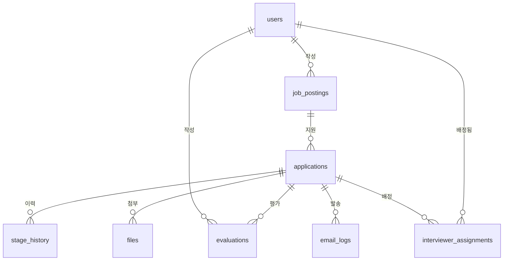

# 01. 테이블 정의서 (ERD)

> **상태: 초안 — UI 완성 후 화면 기준으로 검증·확정한다** (확정 시 이 줄을 "확정 vX.X · 날짜"로 교체)
>
> **규칙: 확정 이후의 모든 변경은 전원 합의로만 한다.**
> 임의로 테이블·컬럼을 추가/변경하지 않는다. 필요하면 팀 채널에 제안 → 합의 → 이 문서 갱신 → 마이그레이션 순서.

필수 23기능 기준. ○ 권장 기능의 확장 포인트는 각 표의 비고에 적어둔다.

## 관계 요약

## 단계(stage) — 고정 enum

`applied`(지원 접수) → `screening`(서류 검토) → `interview`(면접) → `accepted`(최종 합격) / `rejected`(불합격)

- 단계 커스터마이징(B8)은 범위 밖. DB enum이 아닌 **체크 제약 + 코드 상수**로 관리해 마이그레이션 부담을 줄인다.
- 비고: 에이전트 정리→담당자 검수 플로우(여유 기능) 도입 시 `applied` 앞에 `pending_review`(검수 대기) 상태 추가 여지 — 검수 승인 시점에 공식 지원 접수로 진입.
- `rejected`는 어느 단계에서든 진입 가능. 그 외 전진은 순서대로만(뒤로 이동은 담당자 권한). 전환 규칙은 백엔드 서비스 레이어에서 강제한다.

## users — 내부 사용자 (A1·A2)

| 컬럼 | 타입 | 제약 | 설명 |
|---|---|---|---|
| id | bigint | PK | |
| email | varchar(255) | UNIQUE, NOT NULL | 로그인 ID |
| password_hash | varchar(255) | NOT NULL | bcrypt |
| name | varchar(50) | NOT NULL | |
| role | varchar(20) | NOT NULL | `admin` / `recruiter` / `interviewer` |
| created_at | timestamptz | NOT NULL, default now() | |

비고: A5 로그인 이력(권장)은 `login_logs` 별도 테이블로 추가 가능 — 본 스키마 변경 없음.

## job_postings — 채용 공고 (B1·B2)

| 컬럼 | 타입 | 제약 | 설명 |
|---|---|---|---|
| id | bigint | PK | |
| title | varchar(200) | NOT NULL | |
| description | text | | 공고 본문 |
| status | varchar(20) | NOT NULL | `draft` / `open` / `closed` |
| created_by | bigint | FK → users.id | |
| created_at / updated_at | timestamptz | NOT NULL | |

비고: B3 지원자 수는 집계 쿼리로(컬럼 안 둠). B4 마감일 → `deadline date` 컬럼 추가 여지. B6 공개 링크 → `public_token` 추가 여지.

## applications — 지원서 (C1·D1·D6) ★핵심 테이블

지원자는 로그인 없이 지원하므로(C1) 지원자 정보를 별도 인물 테이블로 나누지 않고 지원서에 포함한다. (D11 인재풀을 하게 되면 그때 `applicants` 분리 — 전원 합의 필요)

| 컬럼 | 타입 | 제약 | 설명 |
|---|---|---|---|
| id | bigint | PK | |
| job_posting_id | bigint | FK → job_postings.id, NOT NULL | |
| name | varchar(50) | NOT NULL | |
| email | varchar(255) | NOT NULL | |
| phone | varchar(20) | NOT NULL | |
| education | varchar(100) | | 최종 학력 |
| career_years | smallint | | 경력 연차 (신입=0) |
| skills | text[] | | 기술 태그. 예: `{Python,FastAPI}` |
| self_intro | text | | 자기소개서 |
| current_stage | varchar(20) | NOT NULL, default `applied` | 위 stage enum |
| privacy_agreed_at | timestamptz | NOT NULL | 개인정보 동의 시각 (C3) |
| source | varchar(20) | NOT NULL, default `form` | `form`(외부 지원) / `manual`(담당자 등록, D6) |
| created_at / updated_at | timestamptz | NOT NULL | |

- UNIQUE `(job_posting_id, email)` — 중복 지원 방지(C6, 권장이지만 제약 하나로 끝나므로 처음부터 포함)
- 인덱스: `(job_posting_id, current_stage)` — 칸반·단계 필터(H2). 검색(H1)·10만 건 튜닝용 추가 인덱스는 B 담당이 측정 후 제안(스키마 합의 대상)

## stage_history — 단계 변경 이력 (D5)

| 컬럼 | 타입 | 제약 | 설명 |
|---|---|---|---|
| id | bigint | PK | |
| application_id | bigint | FK → applications.id, NOT NULL | |
| from_stage | varchar(20) | | 최초 접수 시 NULL |
| to_stage | varchar(20) | NOT NULL | |
| changed_by | bigint | FK → users.id, NULL 허용 | NULL = 시스템(외부 지원 접수) |
| created_at | timestamptz | NOT NULL | |

비고: D8 불합격 사유(권장) → `reason text` 컬럼 추가 여지.

## evaluations — 평가 (E1·E2)

| 컬럼 | 타입 | 제약 | 설명 |
|---|---|---|---|
| id | bigint | PK | |
| application_id | bigint | FK → applications.id, NOT NULL | |
| evaluator_id | bigint | FK → users.id, NOT NULL | |
| score | smallint | NOT NULL, 1~5 체크 | |
| comment | text | | |
| created_at / updated_at | timestamptz | NOT NULL | |

비고: E4 항목 분리(권장) → `category` 컬럼 추가 여지. E5 본인만 수정은 코드에서 `evaluator_id` 검사.

## files — 이력서 파일 (F1·F2)

| 컬럼 | 타입 | 제약 | 설명 |
|---|---|---|---|
| id | bigint | PK | |
| application_id | bigint | FK → applications.id, NOT NULL | |
| s3_key | varchar(500) | NOT NULL | 버킷 내 경로 |
| filename | varchar(255) | NOT NULL | 원본 파일명 |
| size_bytes | bigint | NOT NULL | |
| content_type | varchar(100) | NOT NULL | |
| created_at | timestamptz | NOT NULL | |

업로드는 presigned URL로 브라우저 → S3 직행. 서버는 키 발급과 이 레코드만 만든다.

## email_logs — 메일 발송 (G1~G3)

| 컬럼 | 타입 | 제약 | 설명 |
|---|---|---|---|
| id | bigint | PK | |
| application_id | bigint | FK → applications.id, NOT NULL | |
| to_email | varchar(255) | NOT NULL | |
| stage | varchar(20) | NOT NULL | 어떤 단계 변경 건인지 |
| status | varchar(20) | NOT NULL, default `queued` | `queued` / `sent` / `failed` |
| retry_count | smallint | NOT NULL, default 0 | |
| sent_at | timestamptz | | |
| created_at | timestamptz | NOT NULL | |

흐름: 단계 변경 → 이 레코드 생성 + SQS 발행 → 워커가 SES 발송 → status 갱신. 실패 시 재시도(G3), 상한 초과 시 `failed`.

## interviewer_assignments — 면접관 배정 (A3)

면접관은 **본인이 배정된 지원자만** 조회할 수 있다(A3, 필수). 이를 강제하려면 배정 관계가 필요하다.

| 컬럼 | 타입 | 제약 | 설명 |
|---|---|---|---|
| id | bigint | PK | |
| application_id | bigint | FK → applications.id, NOT NULL | |
| interviewer_id | bigint | FK → users.id, NOT NULL | |
| assigned_by | bigint | FK → users.id, NOT NULL | |
| created_at | timestamptz | NOT NULL | |

- UNIQUE `(application_id, interviewer_id)`
